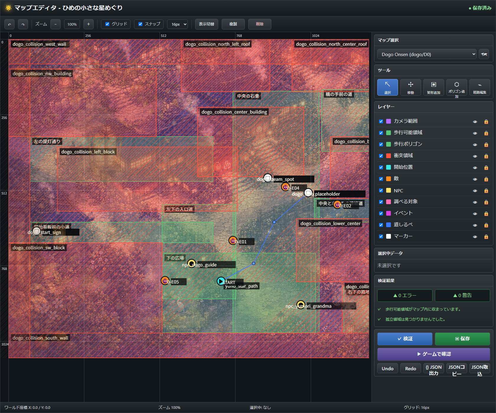

# P6.5 マップエディタ取扱説明書

この文書は、ローカル開発用マップエディタで道後温泉D0および松山城C0のマップレイアウトを調整するための操作説明書です。

マップエディタの目的は、コード上の座標を直接書き換えなくても、背景画像を見ながら歩行可能領域、衝突領域、敵/NPC/イベント配置、道しるべを視覚的に調整し、保存後すぐゲーム内で確認できるようにすることです。



補助スクリーンショット: [横長の全体画面](images/map-editor/map-editor-overview.png)

## 1. 起動方法

リポジトリ直下で開発サーバーを起動します。

```bash
npm run dev
```

Windows PowerShellで `npm.ps1` のExecution Policyに止められる場合は、次を使ってください。

```bash
npm.cmd run dev
```

マップエディタは次のURLで開きます。

```text
http://127.0.0.1:5173/hime-star-journey/map-editor.html
```

専用コマンドで直接開く場合は次を使えます。

```bash
npm run dev:editor
```

```bash
npm.cmd run dev:editor
```

## 2. 編集対象

現在エディタで扱う主なレイアウトJSONは次の2つです。

| マップ | JSON | 用途 |
| --- | --- | --- |
| 道後温泉D0 | `src/data/map-layouts/dogo-D0.json` | P6の道後温泉探索本編 |
| 松山城C0 | `src/data/map-layouts/castle-C0.json` | P7以降の松山城探索準備 |

ゲーム中の配置データは `src/data/mapLayoutRegistry.ts` 経由で読み込まれ、探索画面、敵シンボル、NPC、調べる対象、イベント、道しるべに反映されます。

会話内容、戦闘内容、クエスト進行、報酬などのゲームロジックはこのエディタでは編集しません。エディタはあくまで「世界座標上の配置・通行・衝突・経路」を調整するためのものです。

## 3. 保存される座標について

保存されるのはゲーム世界座標です。

Canvas上の表示位置、ブラウザのスクロール、ズーム率、パン位置は保存されません。たとえばズーム200%でドラッグしても、JSONには実際のワールド座標として保存されます。

このルールがあるため、ゲーム本編とエディタで同じ座標を安全に共有できます。

## 4. 画面構成

画面は大きく5つに分かれます。

| 領域 | 役割 |
| --- | --- |
| 上部ツールバー | Undo/Redo、ズーム、グリッド、スナップ、複製、削除 |
| 中央Canvas | 背景画像と編集レイヤーを重ねて表示する作業領域 |
| 右サイドバー | マップ選択、ツール、レイヤー、選択中データ、検証、保存 |
| プレビュー領域 | 「ゲームで確認」実行後にゲーム本編をiframe表示 |
| 下部ステータスバー | マウス座標、ズーム率、選択中オブジェクト、グリッド幅 |

## 5. レイヤーの意味

右サイドバーの「レイヤー」では、表示/非表示とロックを切り替えられます。

| レイヤー | 色・表示 | 目的 |
| --- | --- | --- |
| カメラ範囲 | 紫 | カメラが追従できる範囲 |
| 歩行可能領域 | 緑の矩形 | プレイヤーが歩ける矩形領域 |
| 歩行ポリゴン | 緑の多角形 | 細かい通路形状を表す歩行可能領域 |
| 衝突領域 | 赤い斜線矩形 | 建物、壁、岩など通れない場所 |
| 開始位置 | 水色 | プレイヤー初期位置 |
| 敵 | オレンジ | 敵シンボル配置 |
| NPC | 黄色 | NPC配置 |
| 調べる対象 | ピンク | 看板、足湯などの調査ポイント |
| イベント | 紫/マゼンタ | 湯の星などのイベント地点 |
| 道しるべ | 青い折れ線 | Hキー/ボタンで表示する推奨経路 |
| マーカー | 白 | ラベルや地物メモ用の補助点 |

目のアイコンで表示切替、鍵アイコンで編集ロックを切り替えます。ロック中のレイヤーはクリック選択やドラッグ編集の対象になりません。

## 6. 基本操作

| 操作 | 内容 |
| --- | --- |
| 左クリック | オブジェクトを選択 |
| ドラッグ | 選択中オブジェクトを移動 |
| 矩形右下ハンドルをドラッグ | 矩形サイズ変更 |
| ポリゴン/経路の頂点をドラッグ | 頂点移動 |
| ポリゴン/経路をダブルクリック | 頂点追加 |
| マウスホイール | ズーム |
| Alt + ドラッグ | 画面パン |
| 中クリック/右クリック + ドラッグ | 画面パン |
| Esc | 選択解除 |
| Delete / Backspace | 選択中オブジェクト削除 |

## 7. キーボードショートカット

| ショートカット | 内容 |
| --- | --- |
| Ctrl/Cmd + S | 保存 |
| Ctrl/Cmd + Z | Undo |
| Ctrl/Cmd + Shift + Z | Redo |
| Ctrl/Cmd + Y | Redo |
| Ctrl/Cmd + C | 選択中オブジェクトをコピー |
| Ctrl/Cmd + V | 複製/貼り付け |
| Delete / Backspace | 削除 |
| Escape | 選択解除 |

## 8. ツール

右サイドバーの「ツール」から編集モードを選びます。

| ツール | 用途 |
| --- | --- |
| 選択 | 既存オブジェクトの選択、移動、サイズ変更 |
| 移動 | 選択物の移動に集中するモード |
| 矩形追加 | 歩行可能領域や衝突領域などの矩形を追加 |
| ポリゴン追加 | 歩行ポリゴンを追加 |
| 経路編集 | 道しるべの折れ線を追加/編集 |

矩形追加、ポリゴン追加、経路編集を使うときは、現在のレイヤー状態を確認してください。ロックされているレイヤーには追加できません。

## 9. グリッドとスナップ

上部ツールバーでグリッド表示とスナップを切り替えられます。

グリッド幅は `8px`、`16px`、`24px`、`32px`、`48px` から選べます。通常は `16px` を基準にし、通路幅の検証や大きな通行帯の調整では `24px` または `48px` も便利です。

スナップONのとき、ドラッグや数値調整はグリッド幅に丸められます。細かい背景に合わせたい場合は一時的にスナップをOFFにしてください。

## 10. 歩行可能領域の編集

道後温泉D0で一番重要なのは、プレイヤーが自然に歩ける通路を作ることです。

おすすめの編集手順は次の通りです。

1. 「歩行可能領域」と「歩行ポリゴン」を表示します。
2. 「衝突領域」も表示し、緑と赤が重なりすぎていないか確認します。
3. 通路が狭い場所は、緑の矩形またはポリゴン頂点を広げます。
4. 建物や壁にめり込む場所は、赤の衝突矩形を調整します。
5. 検証を実行し、孤立領域や到達不能地点がないか確認します。
6. 保存後、「ゲームで確認」で実際に歩いて確認します。

矩形だけで表現しにくい曲がった道や広場の縁は、歩行ポリゴンで調整してください。

## 11. 衝突領域の編集

衝突領域は赤い斜線付き矩形です。建物、塀、岩、屋根、画面外に近い不可視壁など、プレイヤーが入ってはいけない場所を覆います。

注意点:

- 歩行可能領域と重なっても構いませんが、衝突領域が優先されます。
- 重要地点の上に衝突領域がかかると、検証エラーになることがあります。
- 敵/NPC/イベントが衝突領域内にあると、プレイヤーが到達できない配置になります。
- 通路を確保するときは、プレイヤー当たり判定の余白を考えて少し広めにしてください。

## 12. 道しるべの編集

道しるべは青い折れ線で表示されます。ゲーム本編ではHキーまたは道しるべボタンで、プレイヤーが次の目的地へ向かうための目安として使います。

編集手順:

1. 「経路編集」ツールを選びます。
2. Canvas上をクリックして経路点を置きます。
3. 既存の点をドラッグして形を整えます。
4. ダブルクリックで途中点を追加します。
5. 検証で、開始位置から目的地まで到達できるか確認します。

道しるべはプレイヤーを強制移動させるものではありません。迷いにくくするための視覚ガイドです。

## 13. 開始位置、敵、NPC、調べる対象、イベント

これらは点または小さなアイコンとして表示されます。

| 種別 | 編集時の注意 |
| --- | --- |
| 開始位置 | 歩行可能領域内、かつ衝突領域外に置きます |
| 敵 | `D-E01` など実データのIDを維持します |
| NPC | 既存のNPC IDを変更しないでください |
| 調べる対象 | 足湯や看板など、プレイヤーが近づける場所に置きます |
| イベント | 湯の星などメイン進行に関わる地点は特に検証します |
| マーカー | ラベルや目印用。ゲーム進行には直接関係しません |

IDはゲームデータとの接続に使われます。見た目の調整だけが目的なら、IDは変えずに座標だけを動かしてください。

## 14. 右サイドバーの選択中データ

オブジェクトを選択すると、右サイドバーに詳細が表示されます。

主な項目:

- オブジェクト種別
- ID
- X座標
- Y座標
- 幅
- 高さ
- 回転
- 面積
- スナップ幅
- ロック状態
- メモ/ラベル
- 警告
- 頂点追加
- 頂点削除
- 辺分割
- 面反転

マウスで調整しにくい場合は、X/Y/幅/高さを数値入力で直接修正できます。

## 15. Undo / Redo

編集操作はUndo/Redoできます。

- Undo: 上部ツールバーの戻るボタン、または Ctrl/Cmd + Z
- Redo: 上部ツールバーの進むボタン、Ctrl/Cmd + Shift + Z、または Ctrl/Cmd + Y

大きなポリゴン編集や衝突領域の移動前には、一度保存するか、Undoで戻せる範囲を意識してください。

## 16. 検証

右下の「検証」ボタンで、現在のマップレイアウトをチェックします。

主な検証内容:

- IDが空ではないか
- IDが重複していないか
- 矩形の幅/高さが正の値か
- オブジェクトがワールド範囲内にあるか
- ポリゴンが3点以上あるか
- 開始位置が歩行可能領域内にあるか
- 開始位置が衝突領域内にないか
- 敵/NPC/調べる対象/イベントが歩行可能領域内にあるか
- 重要地点へ開始位置から到達できるか
- 通路が狭すぎないか

検証結果にはエラーと警告があります。

| 種別 | 意味 | 保存 |
| --- | --- | --- |
| エラー | ゲーム進行や到達性を壊す可能性が高い問題 | 保存不可 |
| 警告 | 体験上の違和感や将来問題になりそうな箇所 | 保存可能 |

エラーが1件でもある場合、保存はブロックされます。

## 17. よくある検証エラーと直し方

| 表示例 | 原因 | 修正方法 |
| --- | --- | --- |
| 開始位置が歩行可能領域外です | プレイヤー初期位置が緑領域に入っていない | 開始位置を移動するか、歩行領域を広げる |
| 対象が衝突領域内です | 敵/NPC/イベントが赤い領域に重なっている | 対象を移動するか、衝突矩形を縮める |
| 到達できません | 経路が衝突や孤立領域で分断されている | 歩行領域を接続し、通路を広げる |
| 通路幅が狭すぎます | 通路がプレイヤー当たり判定に対して細い | 緑領域を広げる、または衝突領域を避ける |
| IDが重複しています | 同一レイヤー内でIDが被っている | どちらかのIDを変更する |

## 18. 保存

右下の「保存」ボタン、または Ctrl/Cmd + S で保存します。

保存時の流れ:

1. エディタ上で検証を実行します。
2. エラーがある場合は保存しません。
3. 問題がなければ `src/data/map-layouts/*.json` に書き込みます。
4. 保存前の内容を `.map-editor-backups/` に退避します。
5. 画面右上の状態表示が「保存済み」になります。

保存APIはVite開発サーバー専用です。production buildやGitHub Pages上では、ゲームファイルを書き換える保存APIは存在しません。

## 19. バックアップ

保存時には自動でバックアップが作られます。

```text
.map-editor-backups/<mapId>/<timestamp>.json
```

バックアップから戻す場合は、対象バックアップの内容を `src/data/map-layouts/` の該当JSONに戻してください。戻す前に現在のJSONも別名保存しておくと安全です。

## 20. ゲームで確認

「ゲームで確認」ボタンを押すと、保存後のレイアウトを使ってゲーム本編をプレビューできます。

重要な仕様:

- プレビュー前に自動で保存を試みます。
- エラーがある場合、プレビューは開始されません。
- 通常のゲームセーブは汚しません。
- プレビュー専用の一時セーブキーを使います。
- URLには `himeDevMap=<mapId>` と `editorPreview=<timestamp>` が付きます。

通常セーブに影響しないため、道後温泉や松山城の配置確認を何度も行えます。

## 21. JSON出力、コピー、取込

右下のJSON操作で、レイアウトデータを外部確認できます。

| 操作 | 内容 |
| --- | --- |
| JSON出力 | 現在のマップJSONをファイルとしてダウンロード |
| JSONコピー | クリップボードへJSONをコピー |
| JSON取込 | ローカルJSONを読み込み、現在の編集内容として反映 |

JSON取込は強力な操作です。取込前の編集内容は上書きされるため、必要なら先にJSON出力しておいてください。

## 22. コマンドライン検証

エディタの画面検証とは別に、次のコマンドでもマップJSONを検証できます。

```bash
npm run maps:validate
```

```bash
npm.cmd run maps:validate
```

エディタ実装に必要な主要機能が揃っているかを確認するスモークテストは次です。

```bash
npm run editor:smoke
```

```bash
npm.cmd run editor:smoke
```

ドキュメントだけでなく、実装変更を行った場合はできるだけ次も実行してください。

```bash
npm run typecheck
npm run lint
npm run build
```

## 23. 道後温泉D0を調整するときの推奨手順

1. `dogo-D0` を選択します。
2. まず「歩行可能領域」「歩行ポリゴン」「衝突領域」「開始位置」を表示します。
3. 開始位置から中央広場、NPC、敵、湯の星まで緑領域がつながっているか見ます。
4. 通路が赤い衝突領域で分断されていないか確認します。
5. 道しるべを表示し、青い線が自然な道を通っているか調整します。
6. 検証を実行します。
7. 保存します。
8. 「ゲームで確認」で実際に歩きます。
9. 道が狭い、引っかかる、目的地に近づきにくい場所を再調整します。

道後温泉では「背景上の自然な道」と「プレイヤーが通れるゲーム上の道」がズレすぎないことが大切です。

## 24. 松山城C0を調整するときの推奨手順

1. `castle-C0` を選択します。
2. まずカメラ範囲と開始位置を確認します。
3. 登城道、広場、門、戦闘予定地点などの大まかな歩行領域を作ります。
4. 建物や崖、城壁などの衝突領域を置きます。
5. 敵/NPC/イベント候補を配置します。
6. 道しるべを仮配置します。
7. 検証を実行します。
8. ゲームで確認し、P7実装前のベースマップとして保存します。

松山城C0は今後の実装余地を残すため、IDやアセット名は既存データを正として扱ってください。

## 25. ID変更時の注意

IDは画面上のラベルではなく、ゲームデータとの接続キーです。

特に次のIDは不用意に変更しないでください。

- 敵シンボルID
- NPC ID
- 調べる対象ID
- イベントID
- 道しるべID
- 開始位置

IDを変更すると、会話、戦闘、クエスト進行、星取得などが参照できなくなる可能性があります。見た目の位置調整であれば、IDはそのままにしてX/Yだけ変更するのが安全です。

## 26. トラブルシューティング

### 保存できない

検証エラーが残っている可能性があります。「検証」を押して、エラー一覧を確認してください。エラーがある状態では保存されません。

### 保存ボタンを押してもファイルが変わらない

同じ内容の場合は不要な再書き込みを避けます。また、production buildやGitHub Pagesでは保存APIがありません。ローカルVite開発サーバーで開いているか確認してください。

### 背景画像が表示されない

画像読み込みに失敗した場合でもエディタは止まらず、代替表示で継続します。アセットID、`public/assets/generated/`、asset manifest、Viteのbase設定を確認してください。

### ゲームプレビューが開かない

プレビュー前の保存で失敗している可能性があります。検証エラーを直してから再度「ゲームで確認」を押してください。

### クリックしても選択できない

対象レイヤーが非表示またはロックされている可能性があります。右サイドバーの目アイコンと鍵アイコンを確認してください。

### カメラ範囲ばかり選択される

カメラ範囲は枠線や角付近で選択される仕様です。ほかのオブジェクトを選びたい場合は、カメラ範囲レイヤーを一時的にロックまたは非表示にしてください。

### 通路を広げたのに歩けない

歩行可能領域の上に衝突領域が残っている可能性があります。赤い斜線矩形を表示し、通路を塞いでいないか確認してください。

## 27. 変更後の確認チェックリスト

マップを保存する前後に、次を確認してください。

- [ ] 重要地点が歩行可能領域内にある
- [ ] 重要地点が衝突領域内にない
- [ ] 開始位置から敵/NPC/イベントへ到達できる
- [ ] 通路が狭すぎない
- [ ] IDを不要に変更していない
- [ ] 道しるべが自然な道を通っている
- [ ] 検証エラーが0件
- [ ] 保存後にゲームプレビューで確認した
- [ ] 必要なら `npm run maps:validate` を実行した
- [ ] 実装変更を含む場合は `typecheck`、`lint`、`build` を実行した

## 28. 運用上の原則

- エディタはローカル開発用です。
- GitHub Pages上のユーザー向けゲームには保存APIを持たせません。
- JSONの実データを正とし、参考画像のIDや座標は例示として扱います。
- ゲームエンジンや外部ゲームフレームワークは使いません。
- Canvas描画、DOM UI、ゲームロジック、データ、セーブ処理は分離します。
- 画像読み込みに失敗しても、ゲームやエディタが停止しないようにします。

